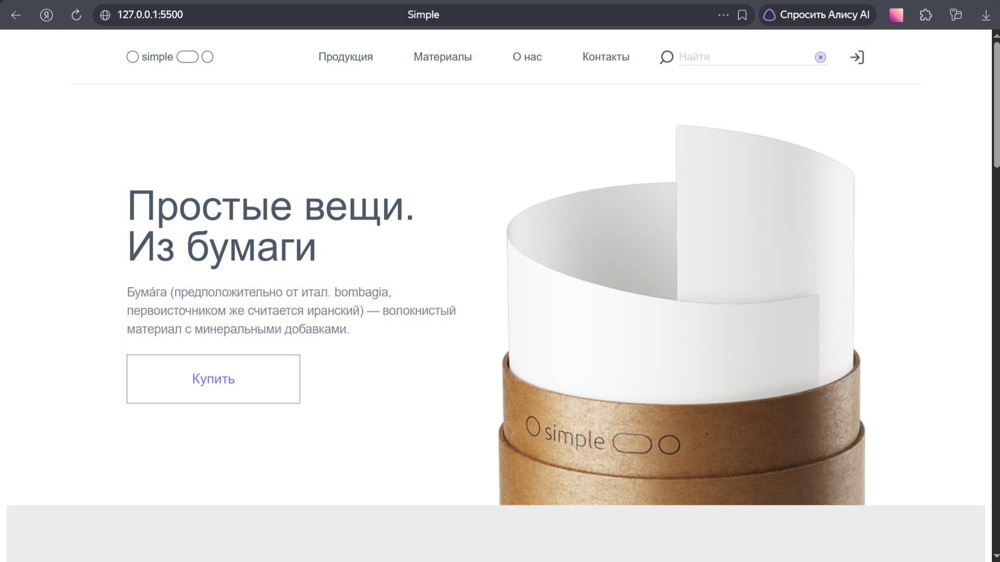
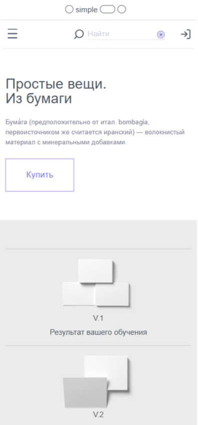

# 🚀 Simple. Веб-сайт про бумажное производство. 

> [!NOTE]
> **Статус:** Проект завершен.

---

## 📝 Описание проекта

Это мой учебный проект по верстке *простого лендинга по макету из Figma*. 
Разработан для отработки навыков *использования библиотеки Bootstrap*.

**Цель работы:** Создать Pixel-Perfect макет, который корректно отображается на всех устройствах от 320px до 1920px и проходит проверку валидатором W3C без ошибок.

---

## 🖥️ Демо 
 
**Макет (исходник):** [Ссылка на макет Figma](https://verstaem.online/projects/simple/)  

### Скриншоты
| Десктоп версия | Мобильная версия |
|:--------------:|:----------------:|
|  |  |

---

## 🛠 Технологический стек

В проекте использованы следующие технологии и подходы:

- 
- 

- **Методология:** БЭМ (Nested) — для структурирования классов.
- **Графика:** SVG-спрайты, WebP (оптимизированные изображения).

---

## 📂 Структура проекта

```bash
├── index.html                # Главная страница
├── css/
│   ├── style.css             # Основные стили
│   └── media.css             # Адаптив (медиазапросы)
│   └── bootstrap.min.css     #Библиотека Bootstrap
├── fonts                     # Папка со шрифтами
├── js/
│   └── script.js             # Небольшие интерактивы (бургер-меню, слайдер)
├── images                    # Контентные изображения (JPG/PNG/WebP)
├── icons/                    # Иконки (SVG)
├── sprite.svg                # Спрайты
│                
└── README.md                 # Этот файл